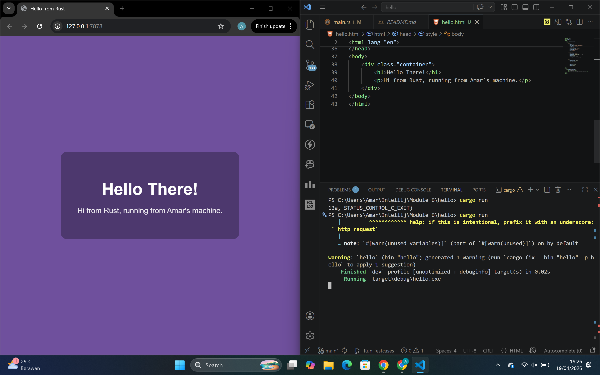
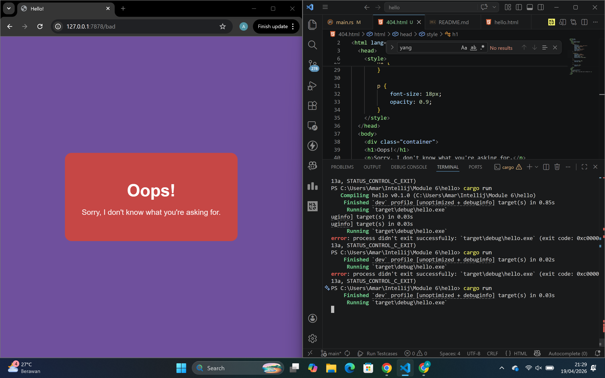

# Commit 1 Reflection Notes
Di bagian ini itu intinya aku udh mulai bikin web server sederhana pakai Rust, yg awalnya cuma nerima koneksi, sekarang udah bisa baca request dari client.

Disini yg aku pelajari itu salah satunya adalah fungsi handle_connection. Jadi setiap ada client yg connect ke server, koneksinya bakal dikirim ke function ini buat diproses. Di dalam function ini, aku pakai BufReader gitu buat baca data dari TcpStream. Tujuannya biar lebih gampang baca request dari client secara baris per baris.

Terus bagian ini:
```rust
.lines()
.map(|result| result.unwrap())
.take_while(|line| !line.is_empty())
.collect()
```

Awalnya emg agak bingung gitu, tapi setelah dipahami intinya itu:
- .lines() --> baca request per baris
- .map(|result| result.unwrap()) --> ambil isi dari setiap baris
- .take_while(|line| !line.is_empty()) --> berhenti baca kalau ketemu baris kosong (ini tanda akhir HTTP header)
- .collect() --> kumpulin semua baris jadi satu vector

Jadi intinya, program ini lagi baca HTTP request dari browser, tapi baru sampai tahap ditampilin aja ke terminal.

Dari sini aku jadi paham kalau:

HTTP request itu ternyata bentuknya text biasa
Ada struktur header yang dipisah baris kosong
Server itu kerjanya nunggu request terus-menerus (looping)

Menurut aku bagian ini penting banget karena ini dasar buat nanti bikin web server yang beneran bisa ngasih response ke client.

# Commit 2 Reflection Notes
Di bagian ini aku lanjut dari sebelumnya, sekarang web server yg aku buat udah bisa ngirim response berupa HTML ke browser. Jadi sebelumnya server cuma baca request dari client, tapi sekarang udah bisa bales request itu dengan ngirim file HTML (`hello.html`).

Disini yg aku aku pelajari itu ada di bagian bagaimana server bisa ngirim response ke client dalam bentuk HTTP response. Di code nya, aku nambah beberapa bagian penting:

```rust
let status_line = "HTTP/1.1 200 OK";
let contents = fs::read_to_string("hello.html").unwrap();
let length = contents.len();

let response =
    format!("{status_line}\r\nContent-Length: {length}\r\n\r\n{contents}");

stream.write_all(response.as_bytes()).unwrap();
```

Penjelasan singkat:
- status_line --> ini status dari HTTP response (200 OK artinya sukses)
- fs::read_to_string --> buat baca isi file HTML
- Content-Length --> kasih tau browser panjang data yg dikirim
- format! --> nyusun response sesuai format HTTP
- write_all --> kirim response ke client (browser)

## Yang terjadi sekarang itu
Kalau aku jalanin server (`cargo run`) terus buka:

http://127.0.0.1:7878

Sekarang browser udah bisa nampilin halaman HTML yg aku buat sendiri. Jadi bukan cuma teks di terminal lagi, tapi beneran muncul di browser.

## Insight yang aku dapet
Dari bagian ini aku jadi lebih ngerti kalau:

- Web server itu intinya nerima request lalu ngirim response
- Response itu harus ada formatnya (kayak status dan Content-Length)
- HTML yang kita buat bisa langsung dikirim dari server ke browser

Menurut aku ini bagian penting banget, karena sekarang server yg aku buat udah mulai keliatan kayak web server beneran, bukan cuma nerima koneksi doang.

## Screenshot


# Commit 3 Reflection Notes
Di bagian ini aku lanjut dari sebelumnya, sekarang server yg aku buat udah bisa ngecek request dari client dan ngasih response yg berbeda.

Jadi kalau request-nya "GET / HTTP/1.1", server bakal ngirim `hello.html`. Tapi kalau request lain, server bakal ngirim `404.html`. Disini aku pakai:

```rust
let request_line = buf_reader.lines().next().unwrap().unwrap();
```
buat ambil request dari client, terus dibandingin:

```rust
if request_line == "GET / HTTP/1.1"
```
Dari sini aku jadi ngerti kalau server bisa ngecek request dan nentuin response sesuai request tersebut.

## Refactoring
Sebelumnya code di if-else itu panjang dan banyak yang sama. Jadi aku refactor jadi:
```rust
let (status_line, filename) = if request_line == "GET / HTTP/1.1" {
    ("HTTP/1.1 200 OK", "hello.html")
} else {
    ("HTTP/1.1 404 NOT FOUND", "404.html")
};
```
Jadi sekarang if-else cuma buat nentuin response, sisanya dijalankan sekali aja di bawah.

Kenapa refactoring penting:
- Bikin code lebih rapi
- Nggak ada duplikasi
- Lebih gampang dibaca

## Insight yang aku dapet
Dari sini aku jadi ngerti kalau server bisa kasih response yang berbeda tergantung request, dan refactoring itu penting buat bikin code lebih clean.

## Screenshot


# Commit 4 Reflection Notes
Di bagian ini aku coba simulasi slow response di server yang aku buat. Jadi aku nambah route baru yaitu `/sleep` yang bikin server delay selama 10 detik sebelum ngasih response. Aku nambah kondisi ini di code:

```rust
"GET /sleep HTTP/1.1" => {
    thread::sleep(Duration::from_secs(10));
    ("HTTP/1.1 200 OK", "hello.html")
}
```
Jadi kalau aku buka `/sleep,` server bakal nunggu dulu sebelum ngirim response.

## Yang terjadi sekarang itu
Pas aku coba buka dua tab browser:
- satu buka `/sleep`
- satu lagi buka `/`
ternyata yang `/` juga ikut nunggu sampai yang `/sleep` selesai.

## Insight yang aku dapet
Dari sini aku jadi ngerti kalau:
- Server yang aku buat masih single-threaded
- Jadi server cuma bisa handle satu request dalam satu waktu
- Kalau ada request yang lama (kayak sleep), request lain jadi ikut ketahan

## Kesimpulan
Dari bagian ini aku jadi ngerti kelemahan dari single-threaded server, dan kenapa kita butuh cara supaya server bisa handle banyak request sekaligus (concurrency/multithreading).

# Commit 5 Reflection Notes
Di bagian ini aku lanjut dari sebelumnya, sekarang aku ubah server yang awalnya single-threaded jadi multithreaded pakai ThreadPool. Jadi sekarang server nggak cuma jalan di satu thread, tapi bisa handle beberapa request sekaligus gituu.

## Apa yang aku pelajari
Di sini aku belajar konsep ThreadPool, yaitu kumpulan thread yang siap dipakai buat ngerjain task.
Jadi alurnya:
- ThreadPool dibuat dengan beberapa worker (thread)
- setiap request masuk akan dikirim sebagai job
- worker yang available bakal ambil job dan jalanin

## Perubahan yang aku lakukan
Di `main.rs`, aku ganti dari langsung handle request jadi pakai ThreadPool:

```rust
pool.execute(|| {
    handle_connection(stream);
});
```

Terus di lib.rs, aku bikin:
- struct ThreadPool
- struct Worker
- channel (mpsc) buat kirim job
- pakai Arc dan Mutex biar bisa dipakai banyak thread

## Insight yang aku dapet
Dari sini aku jadi ngerti kalau:
- multithreading bikin server bisa handle banyak request sekaligus
- request yang lama (kayak /sleep) nggak akan nge-block request lain
- ThreadPool lebih efisien daripada bikin thread baru terus-terusan gituu

## Kesimpulan
Menurut aku ini bagian paling penting karena sekarang server yang aku buat udah bisa jalan lebih optimal dan nggak gampang ke block gitu. Dari sini juga aku jadi lebih ngerti konsep concurrency di Rust, terutama gimana cara manage thread dengan aman.